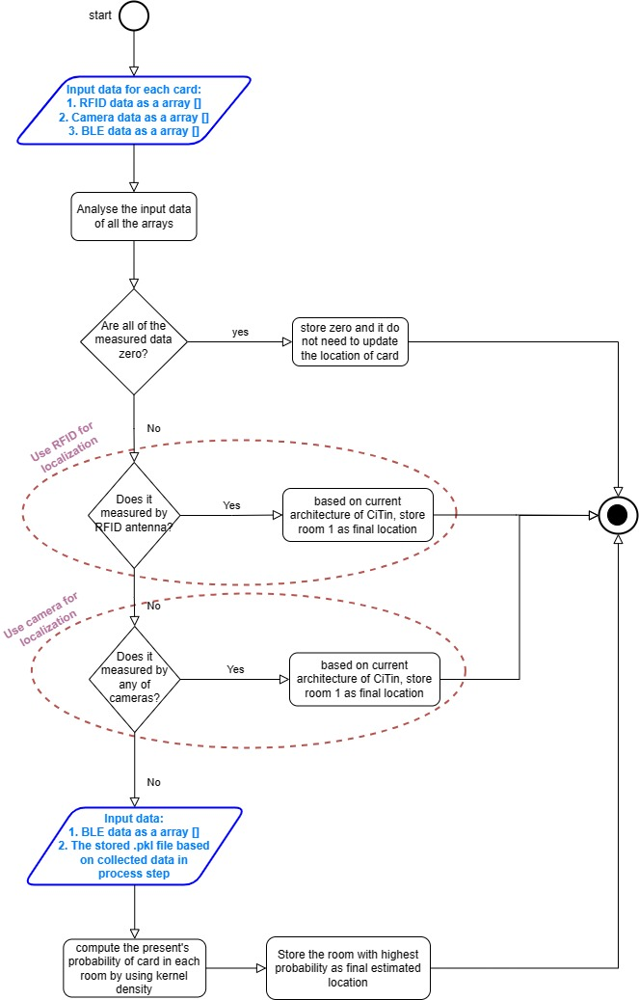

# CIPS

# Table of Contents
 
1. [Project Description](#project-description) 
2. [List of Files](#list-of-files) 
3. [API Endpoints](#api-endpoints) 
4. [Localization](#localization) 
5. [Script File For Localization](#script-file-for-localization) 
6. [Usage](#usage) 


# Project Description
CIPS (Collaborative Indoor Localization System) provides identification, localization, and tracking of assets and people in indoor environments, leveraging a variety of localization technologies, techniques, and algorithms to meet specific requirements and limitations.

The current version of CIPS adopt BLE, RFID, and Aruco technologies and Fingerprint as technique and algorithm to provide location information.

The final design of the project is shown in the following figure:

<div align="center">
    
</div>


## Following steps for providing localization by using fingerprint are performed:

1. Implementing BLE Receivers: The receivers should install around the environment to provide acceptable coverage. 

2. Data Collecting for Fingerprint Map: the cards have to put in various locations and its signal has to measured by all receivers and recorded in a file.

3. PDF File Creation: the kernel density as a PDF method is used as the algorithm to provide the final location estimation collected are used to provide the `.pkl` file by using `PDF.py` code. This file is used by `Localization.py` code to provide location estimation in real time. 

# List of Files

1. **Cards_inventory - Sheet1.csv**
   - Description: CSV file containing card inventory data.

2. **Localization.csv**
   - Description: CSV file related to the localization data.

3. **Localization.pkl**
   - Description: The pickle file related to localization.

4. **Localization.py**
   - Description: Python script for localization.

5. **PDF.py**
   - Description: Python script related to PDF functionality.

6. **index.html**
   - Description: HTML file for the project's main page.

7. **node_V2.mjs**
   - Description: The primer Node.js module file.

8. **requirements.txt**
    - Description: File specifying the required dependencies for the project.

9. **myenv/**
    - Description: Directory related to the virtual environment.

10. **old/**
    - Description: Directory containing old or deprecated files.

11. **README.md**
    - Description: Markdown file serving as the project's README.

12. **device_data.xlsx**
    - Description: Excel file containing device data.


# API Endpoints

The CIPS project exposes the following API endpoints: 
 

 1. **Get Last Recorded Location Data of Card_id**
 
	 -  **Endpoint:**  `/api/getValue`
	 -  **Method:**  `POST`
	 -   **Description:** Retrieves location_id data from positioning table based on the provided string value.
	 -  ```json { "stringValue": "1" }```
	 -   **Response:**
		 - `200 OK` with the retrieved sensor value.
		 - `500 Internal Server Error` for database query failures.
		 
 2. **Get Card Count by Location**
  
    -  **Endpoint:**  `/api/getCardCountByLocation`
	 -  **Method:**  `POST`
	 -   **Description:** Retrieves number of card_id with provided location_id from positioning table based on the provided string value.
	 - ```json { "stringValue": "1" }```
	 -   **Response:**
		 - `200 OK` with the retrieved sensor value.
		 - `500 Internal Server Error` for database query failures.


# Localization

The localization module in the CIPS project is responsible for processing data from BLE devices, RFID tags, and ArUco markers to determine the location of assets within an indoor environment. This module utilizes InfluxDB for BLE data storage and PostgreSQL for final location updates.

For this purpose, this code use from two important file of `Cards_inventory_-_Sheet1.csv` and `Localization.pkl`. 

The module establishes mappings between BLE devices and RFID tags, as well as BLE devices and ArUco markers for each card by using `Cards_inventory_-_Sheet1.csv`. These mappings facilitate the correlation of data from different localization technologies.

The module continuously collects data from InfluxDB, processes BLE, RFID, and ArUco data, and updates the PostgreSQL database with final location information every ten second.

This code has to be run in virtual mode by using the following commands:

`source myenv/bin/activate`
`python3 Localization.py`

The localization process is shown in the following figure:

<div align="center">
    
</div>

# Script File For Localization

This script enhances the CIPS project's visualization by interacting with the API to dynamically update and display information based on user selections. 

## Overview 
The script is designed to work with the CIPS web interface and consists of the following components: 

### Event Listeners 
1. #### Room Selector 
   - **Event**: `change` 
   - **Description**: Fetches API data based on the selected room, updating the visualization accordingly. 
   - **API Endpoint**: `/api/getCardCountByLocation` 
2. #### Rectangle Selector 
   - **Event**: `change` 
   - **Description**: Fetches API data based on the selected rectangle, updating the visualization and result label. 
   - **API Endpoint**: `/api/getValue`

# Usage

To run the CIPS project, follow these steps:

1. Start the front-end server using [http-server](https://www.npmjs.com/package/http-server): 
```bash npx http-server -a 10.10.10.10 -p 3001```

This command launches a simple HTTP server to serve your front-end files.

2. Run the localization module:
```python3 Localization.py```

This command executes the Python script responsible for processing BLE, RFID, and ArUco data and updating the PostgreSQL database with final location information.

3. Start the Node.js module:
```node node_V2.mjs```

This command launches the Node.js module, allowing for real-time communication and interaction with the CIPS system.

